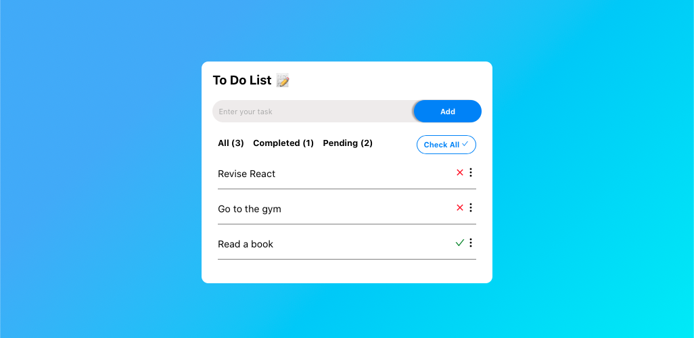

# React To-Do List App

**Table of Contents**
- [Features](#features)
- [Getting Started](#getting-started)
- [Usage](#usage)
- [Technologies Used](#technologies-used)
- [Contributing](#contributing)

This is a simple To-Do List application built using React. It allows you to add, delete, modify, mark tasks as checked or unchecked, and manage your daily tasks efficiently.

## Features
- Add a task: Enter a task and click the "Add" button to add it to your to-do list.
- Modify and delete tasks: Click on the three dots (...) next to a task to display a dropdown menu with options to modify or delete the task.
- Mark as checked/unchecked: Toggle the icon next to a task to mark it as completed or uncompleted.

## Getting Started
1. Change into the project directory:
   cd react-todo-list-app
2. Install the dependencies:
   npm install
3. Start the development server:
   npm start
The app will be available at http://localhost:3000/.

## Usage
1. Add a new task by entering your task text in the input field and clicking the "Add" button.
2. To modify a task, click on the three dots (...) next to the task to display a dropdown menu. Select the "Modify" option and make your changes. Press the icon to save.
3. To delete a task, click on the three dots (...) next to the task to display a dropdown menu. Select the "Delete" option.
4. Mark a task as checked/unchecked by toggling the icon next to the task.

## Technologies Used
- React
- Redux tookit
- CSS

## Contributing
Feel free to contribute to the project. You can submit issues, fork the repository, and create pull requests.

Enjoy using your To-Do List app! If you encounter any issues or have suggestions for improvements, please feel free to open an issue or contribute to the project. Happy task management!
